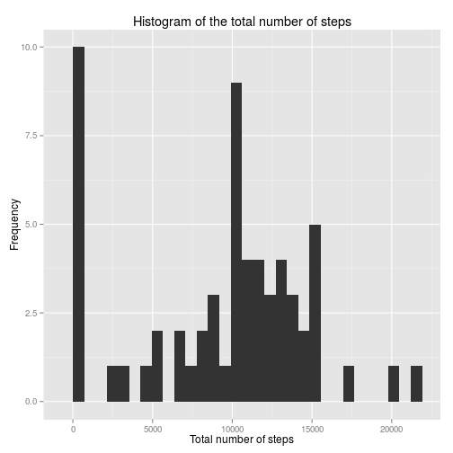
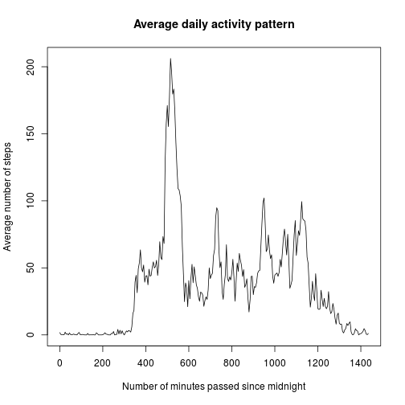
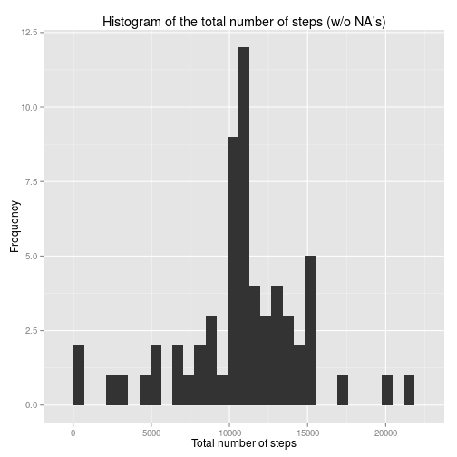
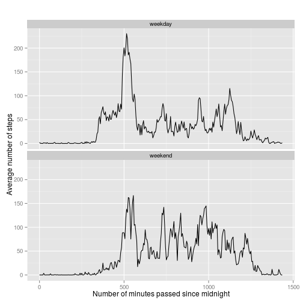

```r
library(knitr)
library(lubridate)
library(ggplot2)
opts_chunk$set(echo = TRUE)
```

## Loading and preprocessing the data
First of all, read in the data using the *read.csv* command. It is assumed the data is directly available in the **activity.csv** file in the current directory (it is hence assumed this file is already unzipped). Explicitly state the column classes and the missing values as `NA`, and convert the `date` column to *POSIXct* objects using the *ymd* function of the *lubridate* package:

```r
data <- read.csv('./activity.csv', na.strings = 'NA',
                 colClasses = c('numeric','character','numeric'))
data$date <- ymd(data$date)
```

One additional preprocessing step should be undertaken. When looking at the interval numbers, it is observed they increase by a step size of 5, except when taking the form xx55, where x can be any number. In that case, the step size is 45, since the last two digits correspond to the hour:minute information at the start of this interval. Especially when visualising these intervals, it is important they are equidistant (as they should be). Hence, we will explicitly introduce a time column, containing the number of minutes passed since the start of the day:

```r
hours <- floor(data$interval/100)
data$time <- data$interval - hours*100 + hours*60
```

**Note:** if your really want to plot as function of the original interval number instead of this new `time` column, change the arguments of the *tapply* functions (see part 2 and 4) so that it orders by the column `interval` instead of `time`.

## What is mean total number of steps taken per day?
To calculate the total number of steps taken per day, we will use the *tapply* function to *sum* over the `step`s per day, contained in the `date` column. Here, all `NA` values are removed. The resulting vector, `totSteps` can then easily be visualised using a histogram (*qplot* function in the *ggplot2* library with only 1 data argument):

```r
totSteps <- tapply(data$steps, data$date, sum, na.rm = TRUE)
qplot(totSteps, xlab = "Total number of steps", ylab = 'Frequency',
     main = "Histogram of the total number of steps")
```

```
## stat_bin: binwidth defaulted to range/30. Use 'binwidth = x' to adjust this.
```

 

The mean and median of the total number of steps per day can be calculated using the code chunks hereunder. First of all, the mean is given by:

```r
mean(totSteps)
```

```
## [1] 9354.23
```
Finally, the median is given by:

```r
median(totSteps)
```

```
## [1] 10395
```

We hence find a mean of `9354` and a median of `10395`.

## What is the average daily activity pattern?
We will first average the number of steps per interval, again using the *tapply* function. The result can easily be plotted using the standard *plot* function:

```r
actDay <- tapply(data$steps, data$time, mean, na.rm = TRUE)
plot(names(actDay), actDay, type = 'l', xlab = 'Number of minutes passed since midnight',
     ylab = 'Average number of steps', main = 'Average daily activity pattern')
```

 

With the function *max* we can find the maximal number of average steps per interval:

```r
max(actDay)
```

```
## [1] 206.1698
```
Using the function *which.max*, the index of this maximal number of steps is returned, from which we can deduce the corresponding interval (given as number of minutes since start of the day):

```r
no_interval <- as.numeric(names(which.max(actDay)))
print(no_interval)
```

```
## [1] 515
```

```r
unique(data$interval[data$time==no_interval])
```

```
## [1] 835
```
We hence see that the maximal number of steps is given by `206`, in the interval starting `515` minutes after midnight. This corresponds to interval number `835` in the original numbering.

## Imputing missing values
Let's first look at the number of missing values, encoded as `NA`s:

```r
missing <- is.na(data$steps)
table(missing)
```

```
## missing
## FALSE  TRUE 
## 15264  2304
```

Going somewhat further, we see that the `2304` missing values all correspond to only eight different days, for which all data is missing (1440 minutes a day yields 288 5-minute intervals):

```r
table(data$date[missing])
```

```
## 
## 2012-10-01 2012-10-08 2012-11-01 2012-11-04 2012-11-09 2012-11-10 
##        288        288        288        288        288        288 
## 2012-11-14 2012-11-30 
##        288        288
```

We will replace the missing values by the (rounded) mean of the given interval, which was already calculated before. To do so, we create a replica of the `steps` vector, and run over each element of it. If this element is missing, we deduce the corresponding interval using the original `data` dataframe, and replace the missing value by the rounded mean of that interval, contained in `actDay`.

```r
steps_mod <- data$steps
for(i in seq_along(steps_mod)){
  if(is.na(steps_mod[i])){
    interval <- as.character(data$time[i])
    steps_mod[i] <- round(actDay[interval])
  }
}
```
Finally, we can create a second data frame, `data_mod`, which contains the modified number of steps, `steps_mod`, and the other columns of the original data frame.

```r
data_mod <- data.frame(steps_mod, data$date, data$interval, data$time)
names(data_mod) <- c("steps","date","interval","time")
```

Let's now redo the data analysis from the first paragraph, using this new data frame

```r
totSteps_mod <- tapply(data_mod$steps, data_mod$date, sum, na.rm = TRUE)
qplot(totSteps_mod, xlab = "Total number of steps", ylab = 'Frequency',
     main = "Histogram of the total number of steps (w/o NA's)")
```

```
## stat_bin: binwidth defaulted to range/30. Use 'binwidth = x' to adjust this.
```

 

```r
mean(totSteps_mod)
```

```
## [1] 10765.64
```

```r
median(totSteps_mod)
```

```
## [1] 10762
```

We see that both the average and median are higher. Indeed, when using the *tapply* function to calculate the total number of steps, dates with missing values are assumed to have a total of 0 steps. This is clearly visible when comparing the height of the first peak (at 0) for the two histograms. If you want to correct for this, you can either impute the missing values as done above, or calculate

```r
mean(totSteps[totSteps!=0])
```

```
## [1] 10766.19
```

```r
median(totSteps[totSteps!=0])
```

```
## [1] 10765
```
We see that these values nicely compare with the values obtained in our approach. Since the `totSteps` vector incorrectly takes some zero values, its median and mean are always lower than the correct values.

## Are there differences in activity patterns between weekdays and weekends?
Let's first extract the day of the week for every observation using the *weekday* function. Then, we will add an extra variable to the modified data frame, `weekend`, which is a logical variable.

```r
days <- weekdays(data_mod$date)
data_mod$weekend <- as.factor(ifelse(days %in% c('Saturday','Sunday'), 
                                     'weekend', 'weekday'))
```

Now determine the average number of steps for every time interval, averaged over every weekday day or weekend day, and store it in a data frame containing three columns: the original `time` column, the averages of each interval per weekday/weekend (`mean`), and finally a factor `weekend` as before.

```r
avWeek <- tapply(data_mod$steps, 
                 list(data_mod$time,data_mod$weekend), 
                 mean, na.rm = TRUE)
avWeek_df <- data.frame(as.numeric(rep(rownames(avWeek),2)))
avWeek_df$mean <- as.numeric(c(avWeek[,1], avWeek[,2]))
avWeek_df$weekend <- as.factor(rep(colnames(avWeek),
                                   each=length(avWeek[,1])))
names(avWeek_df)[1] <- 'time'
```

Finally, plot the average number of steps using *qplot* from the *ggplot2* library

```r
qplot(time, mean, data=avWeek_df, facets = weekend~., main = '' ,
      xlab = 'Number of minutes passed since midnight', 
      ylab = 'Average number of steps', type='l', geom='line',) +
  facet_wrap(~weekend, ncol=1)
```

 
